# BÁO CÁO ĐỒ ÁN TỐT NGHIỆP

## HỆ THỐNG GIÁM SÁT GIAO THÔNG THÔNG MINH VÀ NHẬN DIỆN BIỂN SỐ XE

**Tên dự án:** THL Vehicle Monitoring System  
**Loại hệ thống:** Ứng dụng AI giám sát giao thông — phát hiện phương tiện, tính vận tốc, nhận diện biển số, phát hiện vi phạm  
**Kiến trúc:** Client–Server ba tầng (React + Node.js + Python/FastAPI)

---

## MỤC LỤC

1. [Mục tiêu hệ thống](#chương-1-mục-tiêu-hệ-thống)
2. [Kiến trúc tổng thể](#chương-2-kiến-trúc-tổng-thể)
3. [Luồng xử lý video](#chương-3-luồng-xử-lý-video)
4. [Luồng nhận diện phương tiện](#chương-4-luồng-nhận-diện-phương-tiện)
5. [Luồng nhận diện biển số](#chương-5-luồng-nhận-diện-biển-số)
6. [Luồng OCR biển số](#chương-6-luồng-ocr-biển-số)
7. [Cách tracking phương tiện](#chương-7-cách-tracking-phương-tiện)
8. [Cách lưu kết quả](#chương-8-cách-lưu-kết-quả)
9. [FastAPI hoạt động như thế nào](#chương-9-fastapi-hoạt-động-như-thế-nào)
10. [React Frontend hoạt động như thế nào](#chương-10-react-frontend-hoạt-động-như-thế-nào)
11. [Database hoạt động như thế nào](#chương-11-database-hoạt-động-như-thế-nào)
12. [Giải thích từng file quan trọng](#chương-12-giải-thích-từng-file-quan-trọng)
13. [Giải thích từng hàm quan trọng](#chương-13-giải-thích-từng-hàm-quan-trọng)
14. [Pipeline từ upload video đến trả kết quả](#chương-14-pipeline-từ-upload-video-đến-trả-kết-quả)
15. [Sơ đồ Mermaid](#chương-15-sơ-đồ-mermaid)
16. [Công nghệ sử dụng](#chương-16-công-nghệ-sử-dụng)
17. [Đề xuất cải tiến](#chương-17-đề-xuất-cải-tiến-tăng-độ-chính-xác-nhận-diện-biển-số)
18. [Kết luận](#kết-luận)

---

## CHƯƠNG 1. MỤC TIÊU HỆ THỐNG

### 1.1. Mục tiêu tổng quát

Hệ thống được xây dựng nhằm tự động hóa quy trình giám sát giao thông từ video quay được, thay thế một phần công việc quan sát thủ công của cơ quan quản lý. Hệ thống kết hợp thị giác máy tính (Computer Vision), học sâu (Deep Learning) và ứng dụng web để tạo ra một nền tảng phân tích giao thông hoàn chỉnh.

### 1.2. Mục tiêu cụ thể

| STT | Mục tiêu | Mô tả |
|-----|----------|-------|
| 1 | Phát hiện phương tiện | Nhận diện tự động các loại xe: ô tô, xe máy, xe buýt, xe tải trong video |
| 2 | Theo dõi đối tượng | Gán và duy trì ID ổn định cho từng phương tiện xuyên suốt video |
| 3 | Ước lượng vận tốc | Tính tốc độ di chuyển (km/h) dựa trên hiệu chỉnh không gian ảnh–thực |
| 4 | Nhận diện biển số | Phát hiện vùng biển số và đọc ký tự theo chuẩn biển số Việt Nam |
| 5 | Phát hiện vi phạm | Đánh dấu phương tiện vượt ngưỡng tốc độ cho phép |
| 6 | Trực quan hóa kết quả | Hiển thị video có chú thích (bbox, ID, tốc độ, biển số) trên giao diện web |
| 7 | Lưu trữ và tra cứu | Lưu lịch sử phân tích vào cơ sở dữ liệu, hỗ trợ thống kê và chatbot |
| 8 | Quản lý người dùng | Xác thực, phân quyền admin/user, khảo sát đánh giá hệ thống |

### 1.3. Phạm vi và giới hạn

- **Đầu vào:** File video MP4 (upload qua web) hoặc luồng webcam/RTSP (module phụ).
- **Đầu ra:** Video đã chú thích, file JSON/CSV chứa metadata phát hiện, bản ghi MongoDB.
- **Giới hạn hiện tại:** Hiệu chỉnh tốc độ (homography) gắn với góc quay camera cố định; đường dẫn model và FFmpeg được cấu hình cứng trên Windows; chưa triển khai Docker cho toàn bộ stack.

---

## CHƯƠNG 2. KIẾN TRÚC TỔNG THỂ

### 2.1. Mô hình kiến trúc

Hệ thống tuân theo mô hình **Client–Server phân tầng** với ba dịch vụ độc lập:

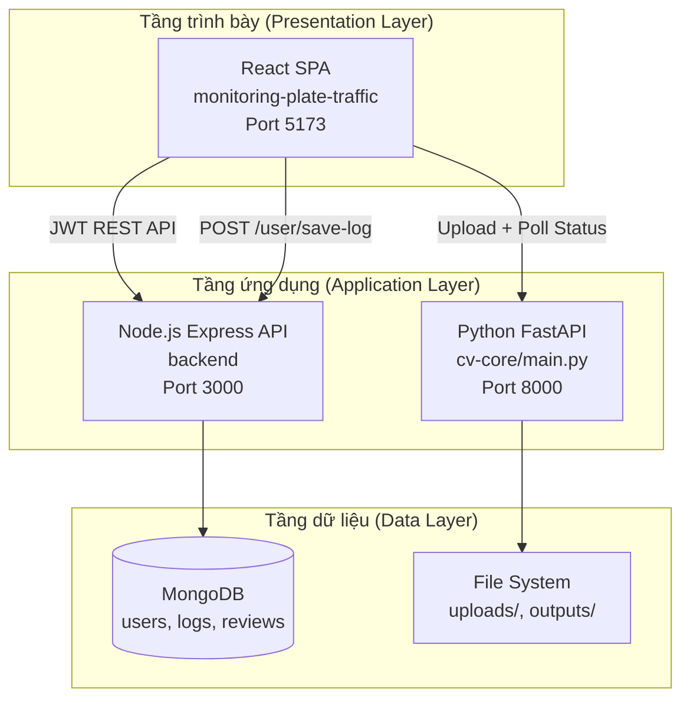

### 2.2. Phân công trách nhiệm các module

| Module | Công nghệ | Trách nhiệm chính |
|--------|-----------|-------------------|
| `cv-core` | Python, FastAPI, YOLO, EasyOCR | Xử lý video, AI inference, xuất MP4/JSON |
| `backend` | Node.js, Express, Mongoose | Xác thực, lưu log, thống kê, chatbot, review |
| `monitoring-plate-traffic` | React, Vite, Axios | Giao diện người dùng, upload, dashboard, biểu đồ |

### 2.3. Luồng tương tác giữa các thành phần

Frontend **không** gọi trực tiếp MongoDB. Thay vào đó:

1. Gọi **cv-core** để xử lý video (không cần JWT).
2. Sau khi có kết quả, gọi **backend** (có JWT) để lưu log.
3. Các trang Statistics, Chatbot, Vehicle đọc dữ liệu từ backend.

Backend **không** gọi cv-core — hai dịch vụ Python và Node.js được frontend điều phối.

---

## CHƯƠNG 3. LUỒNG XỬ LÝ VIDEO

### 3.1. Tổng quan

Luồng xử lý video được triển khai trong hàm `process_video()` tại file `cv-core/main.py`. Mỗi video được xử lý theo mô hình **job bất đồng bộ**: upload → hàng đợi → xử lý từng frame → mã hóa lại → xuất kết quả.

### 3.2. Các giai đoạn xử lý video

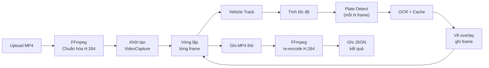

### 3.3. Chi tiết từng bước

**Bước 1 — Tiếp nhận và chuẩn hóa video**

- Endpoint `POST /process` nhận file qua `UploadFile`, lưu vào thư mục `uploads/`.
- FFmpeg chuyển đổi video sang codec H.264 (`libx264`, CRF 18) để đảm bảo tương thích khi đọc bằng OpenCV.

**Bước 2 — Khởi tạo trình đọc video**

```python
cap = cv2.VideoCapture(input_path)
fps    = cap.get(cv2.CAP_PROP_FPS) or 30.0
width  = int(cap.get(cv2.CAP_PROP_FRAME_WIDTH))
height = int(cap.get(cv2.CAP_PROP_FRAME_HEIGHT))
total  = int(cap.get(cv2.CAP_PROP_FRAME_COUNT))
```

**Bước 3 — Vòng lặp frame**

Với mỗi frame:

- Chạy vehicle tracking.
- Tính vận tốc cho từng track ID.
- Mỗi `OCR_EVERY_N = 5` frame: phát hiện biển số và chạy OCR.
- Vẽ bounding box, nhãn, tốc độ, biển số lên frame.
- Ghi frame đã chú thích vào `VideoWriter`.
- Cập nhật tiến độ job: `progress = frame_idx / total * 100`.

**Bước 4 — Mã hóa lại video**

- Video thô ghi bằng codec `mp4v`, sau đó FFmpeg re-encode sang H.264 để phát trên trình duyệt.
- Trạng thái job chuyển sang `"encoding"`.

**Bước 5 — Xuất JSON**

- Tổng hợp `detections_all` (mọi frame) và `summary` (mỗi xe một bản ghi).
- Lưu tại `outputs/{job_id}.json`.

---

## CHƯƠNG 4. LUỒNG NHẬN DIỆN PHƯƠNG TIỆN

### 4.1. Mô hình sử dụng

Hệ thống sử dụng mô hình **YOLOv8** (thư viện Ultralytics) được huấn luyện tùy chỉnh trên tập dữ liệu phương tiện giao thông Việt Nam. Weights lưu tại `backup/vehicle_model_v23/weights/best.pt`.

**Các lớp phát hiện:** Car, Motorcycle, Bus, Truck (tùy cấu hình huấn luyện).

### 4.2. Quy trình phát hiện và theo dõi

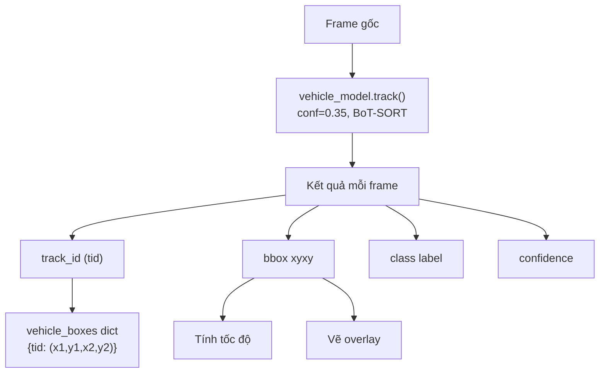

### 4.3. Lời gọi API chính

```python
results = vehicle_model.track(
    frame,
    persist=True,
    conf=0.35,
    tracker=TRACKER_CONFIG,  # botsort.yaml
    device=device,
    verbose=False
)
```

- **`persist=True`:** Duy trì trạng thái tracker giữa các frame, không reset ID mỗi frame.
- **`conf=0.35`:** Ngưỡng confidence — loại bỏ detection yếu.
- **`tracker=TRACKER_CONFIG`:** Sử dụng BoT-SORT thay vì tracker mặc định.

### 4.4. Dữ liệu trích xuất mỗi phương tiện

| Trường | Nguồn | Ý nghĩa |
|--------|-------|---------|
| `id` | `boxes.id` | Track ID duy nhất |
| `label` | `vehicle_model.names[cls]` | Loại xe |
| `conf` | `boxes.conf` | Độ tin cậy detection |
| `bbox` | `boxes.xyxy` | Tọa độ hộp bao [x1, y1, x2, y2] |
| `speed` | Tính toán homography | Tốc độ km/h (sau lọc Kalman) |
| `status` | So sánh speed vs limit | `"violation"` hoặc `"normal"` |

---

## CHƯƠNG 5. LUỒNG NHẬN DIỆN BIỂN SỐ

### 5.1. Kiến trúc hai tầng

Nhận diện biển số gồm hai tầng:

1. **Tầng phát hiện (Detection):** Mô hình YOLO chuyên biển số (`plate_model`) — xác định vùng chứa biển.
2. **Tầng nhận dạng (Recognition):** Module OCR (`PlateOCR`) — đọc ký tự từ vùng crop.

### 5.2. Luồng phát hiện biển số trong pipeline chính

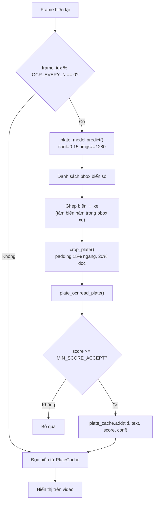

### 5.3. Thuật toán ghép biển số với phương tiện

Sau khi phát hiện biển số trên toàn frame, hệ thống xác định xe sở hữu biển bằng quy tắc **spatial containment**:

1. Tính tâm biển số: `pcx = (px1 + px2) // 2`, `pcy = (py1 + py2) // 2`.
2. Duyệt tất cả `vehicle_boxes` — kiểm tra tâm biển có nằm trong bbox xe không.
3. Nếu nhiều xe thỏa mãn, chọn xe có khoảng cách Euclidean từ tâm biển đến tâm xe **nhỏ nhất**.

### 5.4. Module phát hiện biển số độc lập (`detect-plate/`)

Module `detect-plate/main/detector.py` triển khai pipeline offline:

```python
def detect_plates(model, frame):
    results = model.predict(source=frame, conf=DET_CONF, iou=DET_IOU, imgsz=IMG_SIZE)
    # Lọc NMS thủ công: giữ detection conf cao, loại trùng IoU > 0.40
```

Khác với pipeline chính, module này tracking biển số bằng **IoU Tracker tùy chỉnh** (không dùng BoT-SORT), phục vụ thử nghiệm và đánh giá độc lập.

---

## CHƯƠNG 6. LUỒNG OCR BIỂN SỐ

### 6.1. Tổng quan module PlateOCR

Class `PlateOCR` (file `cv-core/main.py`) là lõi nhận dạng ký tự biển số Việt Nam. Module hỗ trợ:

- Biển ô tô 1 dòng: `51A-123.45`
- Biển ô tô 2 dòng: `51A` + `123.45`
- Biển xe máy 1 dòng: `51-A1 123.45`
- Biển xe máy 2 dòng: `51-A1` + `123.45`

### 6.2. Pipeline OCR chi tiết

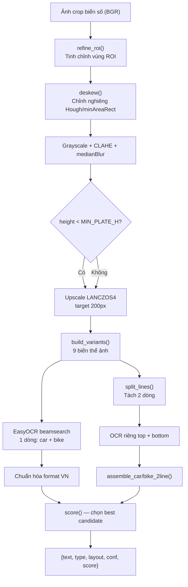

### 6.3. Tiền xử lý ảnh

| Hàm | Mục đích | Kỹ thuật |
|-----|----------|----------|
| `refine_roi()` | Cắt sát vùng biển | Contour detection + Otsu threshold |
| `deskew()` | Chỉnh góc nghiêng | Hough Lines (±20°) hoặc minAreaRect fallback |
| `_clahe()` | Cân bằng histogram | CLAHE clipLimit=3.0, tile 8×8 |
| `_upscale()` | Phóng to biển nhỏ | LANCZOS4, target height 200px |
| `build_variants()` | Tạo 9 biến thể | CLAHE, bilateral, sharpen×2, Otsu×2, adaptive×2, morph close |

### 6.4. Nhận dạng ký tự

Engine OCR sử dụng **EasyOCR** với cấu hình:

```python
self.reader.readtext(
    img,
    detail=1,
    paragraph=False,
    decoder="beamsearch",
    allowlist=allowlist_full
)
```

### 6.5. Chuẩn hóa biển số Việt Nam

- **`l2d()` / `d2l()`:** Chuyển ký tự dễ nhầm (O→0, I→1, B→8, …).
- **`norm_car_1line()`:** Khớp pattern `\d{2}[A-Z]-\d{3}.\d{2}` hoặc `\d{2}[A-Z]-\d{4}`.
- **`norm_bike_1line()`:** Khớp pattern `\d{2}-[A-Z]\d \d{3}.\d{2}`.
- **`ALLOWED_SERIES`:** Chỉ chấp nhận series hợp lệ: `ABCDEFGHKLMNPRSTUVXYZ`.

### 6.6. Hệ thống chấm điểm (Scoring)

Hàm `score()` tính điểm cho mỗi ứng viên:

```
score = bonus_format_regex + conf × 2.5 - conversion_penalty × 0.3 + 0.5 (nếu layout 2 dòng)
```

Chỉ chấp nhận kết quả khi `score >= MIN_SCORE_ACCEPT (3.5)`.

### 6.7. PlateCache — Bỏ phiếu đa số (Majority Vote)

Class `PlateCache` lưu lịch sử OCR theo `track_id` và chọn biển tốt nhất:

```
key = score_sum × 2.0 + count × 0.5 + best_score
```

Điều này giảm nhiễu OCR frame-by-frame: một biển đọc đúng nhiều lần sẽ thắng biển đọc sai một lần với confidence cao.

---

## CHƯƠNG 7. CÁCH TRACKING PHƯƠNG TIỆN

### 7.1. Thuật toán BoT-SORT

Pipeline chính sử dụng **BoT-SORT** (Bootstrap Tracking with SORT), cấu hình trong `cv-core/botsort.yaml`:

| Tham số | Giá trị | Ý nghĩa |
|---------|---------|---------|
| `track_high_thresh` | 0.5 | Ngưỡng detection mạnh |
| `track_low_thresh` | 0.1 | Ngưỡng detection yếu (recovery) |
| `new_track_thresh` | 0.6 | Ngưỡng tạo track mới |
| `match_thresh` | 0.8 | Ngưỡng khớp track-detection |
| `with_reid` | True | Bật Re-identification |
| `track_buffer` | 30 | Số frame giữ track sau khi mất detection |
| `n_init` | 3 | Số frame xác nhận trước khi track active |

### 7.2. Nguyên lý hoạt động BoT-SORT

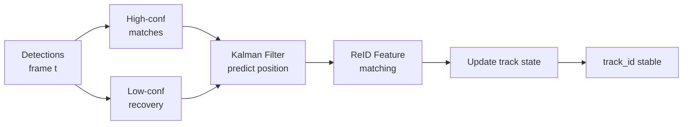

BoT-SORT kết hợp:

- **Kalman Filter** — dự đoán vị trí bbox frame tiếp theo.
- **IoU matching** — ghép detection mới với track hiện có.
- **ReID** — so khớp đặc trưng ngoại hình khi xe bị che khuất tạm thời.

### 7.3. Tracker biển số (module detect-plate)

Module offline dùng **IoU Tracker** (`detect-plate/main/tracker.py`):

- Ghép detection mới với track có IoU cao nhất (ngưỡng 0.25).
- **EMA smoothing** (`TRACK_BOX_ALPHA = 0.6`) — làm mượt bbox.
- Xóa track sau `TRACK_MAX_MISS = 20` frame không thấy.

### 7.4. Ý nghĩa track_id trong hệ thống

`track_id` là khóa liên kết xuyên suốt pipeline:

- Gắn tốc độ (`prev_world`, `kalman_map`, `speed_hist`).
- Gắn biển số (`plate_cache`).
- Gắn kết quả cuối trong `summary`.

---

## CHƯƠNG 8. CÁCH LƯU KẾT QUẢ

### 8.1. Lưu trữ tạm thời (cv-core)

| Loại | Đường dẫn | Nội dung |
|------|-----------|----------|
| Video upload | `uploads/{job_id}_clean.mp4` | Video đã chuẩn hóa (xóa sau xử lý) |
| Video kết quả | `outputs/{job_id}.mp4` | Video có overlay bbox/speed/plate |
| JSON kết quả | `outputs/{job_id}.json` | Toàn bộ detections + summary |
| Job state | `jobs[job_id]` (in-memory) | Trạng thái, progress, URLs |

**Cấu trúc JSON:**

```json
{
  "detections_all": [
    {
      "frame": 120, "time": "00:00:04", "id": 3,
      "label": "Car", "conf": 0.91, "speed": 72.5,
      "plate": "51A-123.45", "status": "violation",
      "bbox": [100, 200, 300, 400]
    }
  ],
  "summary": [
    { "id": 3, "label": "Car", "speed": 72.5, "plate": "51A-123.45", "status": "violation" }
  ],
  "total_vehicles": 12,
  "violations": 2
}
```

### 8.2. Lưu trữ lâu dài (MongoDB)

Frontend gọi `POST /user/save-log` sau khi xử lý xong. Backend lưu vào collection `logs`.

**Schema Log:**

```javascript
{
  user: ObjectId,
  email: String,
  videoName: String,
  originalName: String,
  resultVideoUrl: String,
  speedLimit: Number,
  createdAt: Date,
  detections: [
    { frame, id, label, conf, bbox, speed, time, status, plate }
  ]
}
```

### 8.3. Xuất CSV (Frontend)

Hàm `exportCSV()` trong `Dashboard1.jsx` tạo file CSV UTF-8 BOM với các cột: ID, Vehicle, Confidence, Time, Speed, Plate, Status, BBox.

### 8.4. Luồng lưu trữ hoàn chỉnh

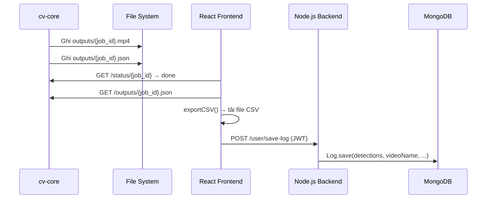

---

## CHƯƠNG 9. FASTAPI HOẠT ĐỘNG NHƯ THẾ NÀO

### 9.1. Khởi tạo ứng dụng

File `cv-core/main.py` khởi tạo FastAPI app với CORS mở và mount static files:

```python
app = FastAPI(title="Vehicle Monitoring API")
app.add_middleware(CORSMiddleware, allow_origins=["*"], ...)
app.mount("/outputs", StaticFiles(directory=OUTPUT_DIR), name="outputs")
```

### 9.2. Mô hình xử lý bất đồng bộ

FastAPI **không** xử lý video trong request handler. Thay vào đó:

1. Handler `start_process()` nhận file, tạo `job_id`, lưu file, khởi tạo job dict.
2. Spawn **background thread** (`threading.Thread`) chạy `process_video()`.
3. Trả về `{ job_id }` ngay lập tức — client poll status sau.

### 9.3. Quản lý trạng thái job

| Trạng thái | Ý nghĩa |
|------------|---------|
| `queued` | Job vừa tạo, thread chưa bắt đầu |
| `processing` | Đang xử lý frame |
| `encoding` | Đang re-encode H.264 |
| `done` | Hoàn tất, có video_url và result_url |
| `error` | Lỗi, kèm message |

### 9.4. Các endpoint

| Method | Path | Handler | Chức năng |
|--------|------|---------|-----------|
| POST | `/process` | `start_process()` | Upload video + speed_limit |
| GET | `/status/{job_id}` | `get_status()` | Trả progress, URLs |
| DELETE | `/job/{job_id}` | `delete_job()` | Xóa job và file output |
| GET | `/health` | `health()` | Kiểm tra device, OCR engine |
| GET | `/outputs/{file}` | StaticFiles | Phục vụ MP4/JSON |

### 9.5. Khởi tạo model một lần (Singleton)

Models được load **một lần** khi server start:

```python
vehicle_model = YOLO(VEHICLE_MODEL_PATH).to(device)
plate_model   = YOLO(PLATE_MODEL_PATH).to(device)
ocr_reader    = easyocr.Reader(["en"], gpu=(device == "cuda"))
plate_ocr     = PlateOCR(reader=ocr_reader)
```

---

## CHƯƠNG 10. REACT FRONTEND HOẠT ĐỘNG NHƯ THẾ NÀO

### 10.1. Kiến trúc SPA

Frontend là **Single Page Application** xây dựng bằng React 19 + Vite, routing qua React Router 7.

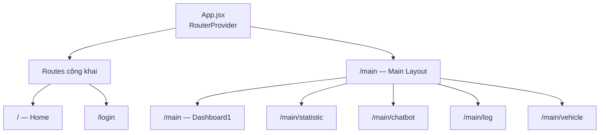

### 10.2. Luồng xác thực

1. **Login:** `POST /auth/login` → lưu `accessToken`, `refreshToken`, `user` vào `localStorage`.
2. **Mọi request API:** `axiosInstance` interceptor tự gắn `Authorization: Bearer {token}`.
3. **Token hết hạn (401/403):** Tự động gọi `POST /user/refresh-token`, retry request; nếu fail → redirect `/login`.

### 10.3. Luồng upload và phân tích video (Dashboard1)

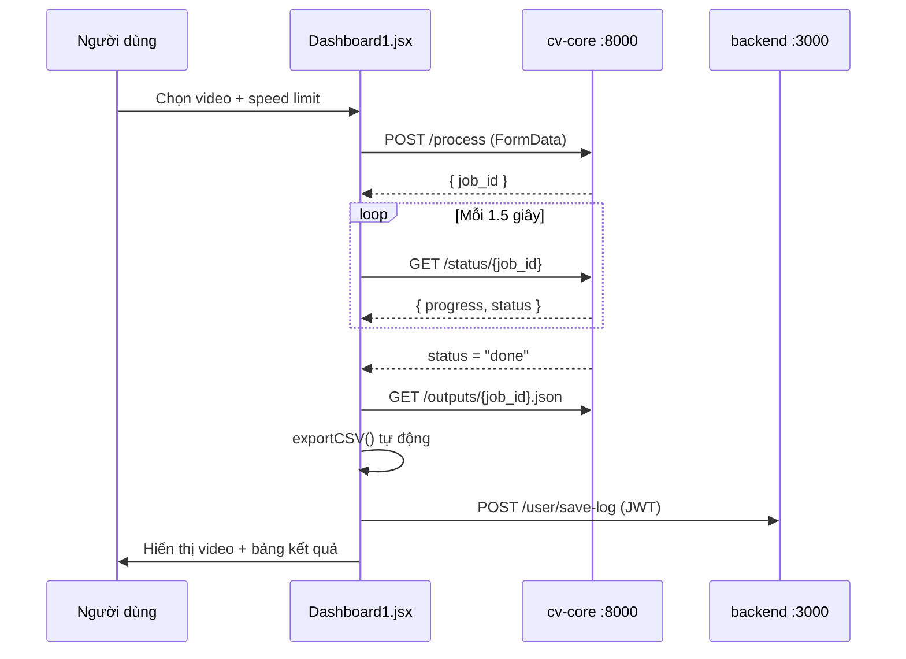

### 10.4. Các trang chức năng chính

| Component | Chức năng | API sử dụng |
|-----------|-----------|-------------|
| `Dashboard1.jsx` | Upload, poll, hiển thị kết quả | cv-core + `/user/save-log` |
| `Statistic.jsx` | Biểu đồ Chart.js | `/user/logs` hoặc `/user/me/logs` |
| `Chatbot1.jsx` | Hỏi đáp thống kê | `/stats/chatbot/query` |
| `Log.jsx` | Lịch sử phân tích | `/user/logs?date=&keyword=` |
| `Vehicle.jsx` | Bảng phương tiện | `/user/vehicles?page=&plate=&overspeed=` |
| `User.jsx` | Quản lý user (admin) | `/user/admin/users` |

---

## CHƯƠNG 11. DATABASE HOẠT ĐỘNG NHƯ THẾ NÀO

### 11.1. Hệ quản trị cơ sở dữ liệu

Hệ thống sử dụng **MongoDB** (NoSQL document database) qua ODM **Mongoose**. Connection string: `process.env.MONGO_URL`.

### 11.2. Sơ đồ dữ liệu

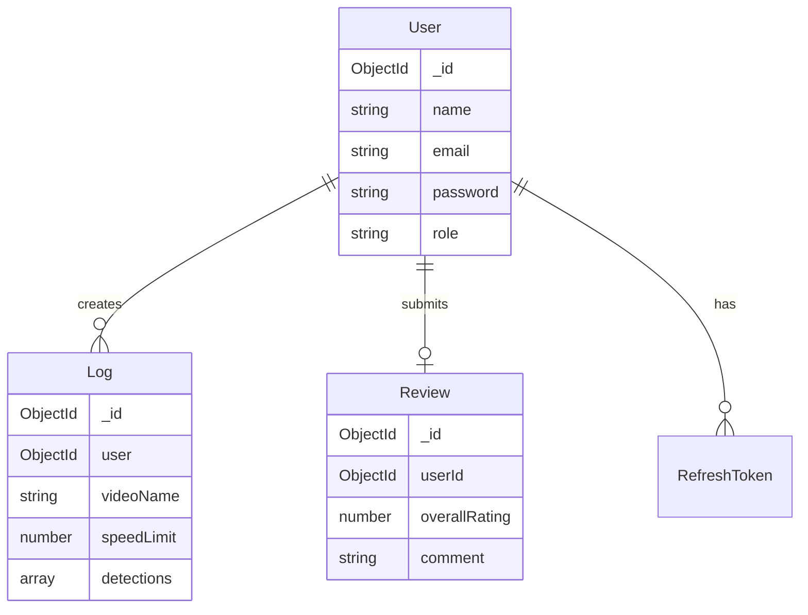

### 11.3. Collection chi tiết

**Users** — Quản lý tài khoản, phân quyền `admin` / `user`, xác thực email.

**Logs** — Lưu kết quả phân tích video. Mỗi document chứa mảng `detections` embedded.

**RefreshTokens** — Lưu refresh token để hỗ trợ JWT rotation.

**Reviews** — Khảo sát đánh giá hệ thống sau khi sử dụng.

### 11.4. Truy vấn aggregation (Chatbot)

`statController.js` sử dụng MongoDB Aggregation Pipeline:

- **`#getOverview()`:** Đếm video, phát hiện, vi phạm.
- **`#getFastestVehicle()`:** Xe nhanh nhất toàn hệ thống.
- **`#getViolationPlates()`:** Biển số vi phạm nhiều nhất.
- **`#getViolationsByDay()`:** Thống kê vi phạm theo ngày.

Intent detection dựa trên **keyword matching** tiếng Việt.

---

## CHƯƠNG 12. GIẢI THÍCH TỪNG FILE QUAN TRỌNG

### 12.1. Module cv-core

| File | Vai trò |
|------|---------|
| `main.py` | File trung tâm — FastAPI, PlateOCR, process_video, endpoints |
| `streamspeedocr.py` | Biến thể API, OCR thưa hơn (OCR_EVERY_N=33) |
| `botsort.yaml` | Cấu hình tracker BoT-SORT |
| `detect-plate/main/pipeline.py` | Pipeline offline 3-pass |
| `detect-plate/main/ocr_engine.py` | Bản sao logic PlateOCR |
| `detect-plate/main/detector.py` | `detect_plates()`, `crop_plate()` |
| `detect-plate/main/tracker.py` | IoU Tracker cho biển số offline |
| `main/main1.py` | FastAPI + WebSocket streaming |
| `main/streamspeed.py` | WebSocket với speed overlay |

### 12.2. Module backend

| File | Vai trò |
|------|---------|
| `src/index.js` | Entry point Express, port 3000 |
| `src/routes/index.js` | Mount routes |
| `src/app/models/Log.js` | Schema MongoDB cho log |
| `src/app/controllers/userController.js` | save-log, refresh-token, get logs |
| `src/app/controllers/statController.js` | Chatbot aggregation pipelines |
| `src/app/controllers/vehicleController.js` | Flatten detections, filter, pagination |
| `src/app/controllers/authControllers.js` | Login, register, email verification |
| `src/app/middlewares/auth.js` | JWT verify middleware |

### 12.3. Module frontend

| File | Vai trò |
|------|---------|
| `src/App.jsx` | Router configuration |
| `src/components/dashboard/Dashboard1.jsx` | Dashboard chính — upload, poll, export, save log |
| `src/utils/axiosInstance.js` | Axios + JWT interceptor + auto refresh |
| `src/components/statistics/Statistic.jsx` | Charts thống kê |
| `src/components/chatbot/Chatbot1.jsx` | Chatbot UI |
| `src/components/log/Log.jsx` | Danh sách lịch sử |
| `src/components/vehicles/Vehicle.jsx` | Bảng phương tiện có filter |

---

## CHƯƠNG 13. GIẢI THÍCH TỪNG HÀM QUAN TRỌNG

### 13.1. cv-core/main.py

| Hàm / Class | Input | Output | Mô tả |
|-------------|-------|--------|-------|
| `KalmanSpeed.update(raw)` | Tốc độ thô | Tốc độ đã lọc | Kalman Filter 1D |
| `pixel_to_world(px, py)` | Tọa độ pixel | (wx, wy) mét | Homography transform |
| `PlateOCR.read_plate(crop)` | Ảnh BGR crop biển | `{text, type, conf, score}` | Pipeline OCR đầy đủ |
| `PlateOCR.refine_roi()` | Ảnh crop | ROI tinh chỉnh | Contour-based tightening |
| `PlateOCR.deskew()` | Ảnh BGR | Ảnh đã chỉnh nghiêng | Hough + minAreaRect |
| `PlateOCR.build_variants()` | Grayscale | List 9 ảnh | Multi-variant preprocessing |
| `PlateOCR.score(cand)` | Candidate dict | Float score | Chấm điểm format + confidence |
| `PlateCache.add(tid, ...)` | track_id, OCR result | — | Thêm vào lịch sử |
| `PlateCache.best(tid)` | track_id | `{text, score, conf}` | Majority vote |
| `crop_plate(frame, bbox)` | Frame + bbox | Crop BGR | Padding 15%/20% |
| `process_video(...)` | job_id, path, limit | — | Hàm xử lý chính |
| `start_process(...)` | UploadFile | `{job_id}` | FastAPI handler, spawn thread |
| `reencode_h264(...)` | Path MP4 thô | Path MP4 H.264 | FFmpeg transcoding |

### 13.2. backend

| Hàm | Mô tả |
|-----|-------|
| `UserControllers.createLog()` | Nhận detections, tạo document Log, `log.save()` |
| `UserControllers.refreshToken()` | Verify refresh token, phát access token mới |
| `AuthControllers.userLogin()` | bcrypt compare, kiểm tra verified, phát JWT |
| `StatController.#detectIntent()` | Keyword matching → intent string |
| `StatController.#fetchData()` | Dispatch aggregation pipeline theo intent |
| `VehicleController.getVehicles()` | Flatten detections, filter + paginate |

### 13.3. frontend

| Hàm | Mô tả |
|-----|-------|
| `Dashboard1.handleUpload()` | Tạo FormData, POST /process, bắt đầu poll |
| `Dashboard1.pollStatus(id)` | Vòng lặp while, sleep 1.5s, cập nhật progress |
| `Dashboard1.fetchDetections(url)` | GET JSON, lấy `summary`, sort by id |
| `Dashboard1.exportCSV()` | Tạo Blob UTF-8 BOM, trigger download |
| `Dashboard1.saveLog()` | POST /user/save-log qua axiosInstance |

---

## CHƯƠNG 14. PIPELINE TỪ UPLOAD VIDEO ĐẾN TRẢ KẾT QUẢ

### 14.1. Sequence diagram đầy đủ

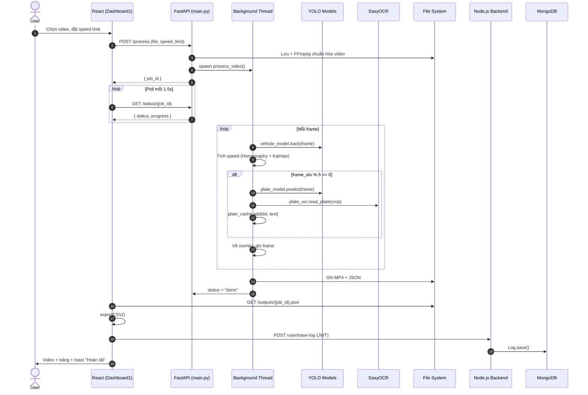

### 14.2. Timeline xử lý một job

| Thời điểm | Sự kiện | Trạng thái job |
|-----------|---------|----------------|
| T+0ms | Upload hoàn tất | `queued` |
| T+100ms | Thread bắt đầu | `processing` |
| T+100ms → T+N | Xử lý từng frame | `processing` (0→99%) |
| T+N | Ghi xong frame cuối | `encoding` |
| T+N+2s | FFmpeg re-encode xong | `done` (100%) |
| T+N+3s | Frontend fetch JSON, save log | — |

---

## CHƯƠNG 15. SƠ ĐỒ MERMAID

### 15.1. Pipeline AI hoàn chỉnh

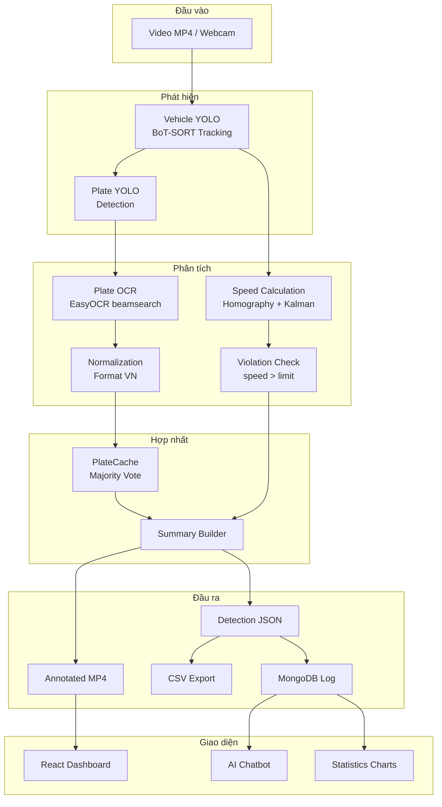

### 15.2. Sơ đồ use case

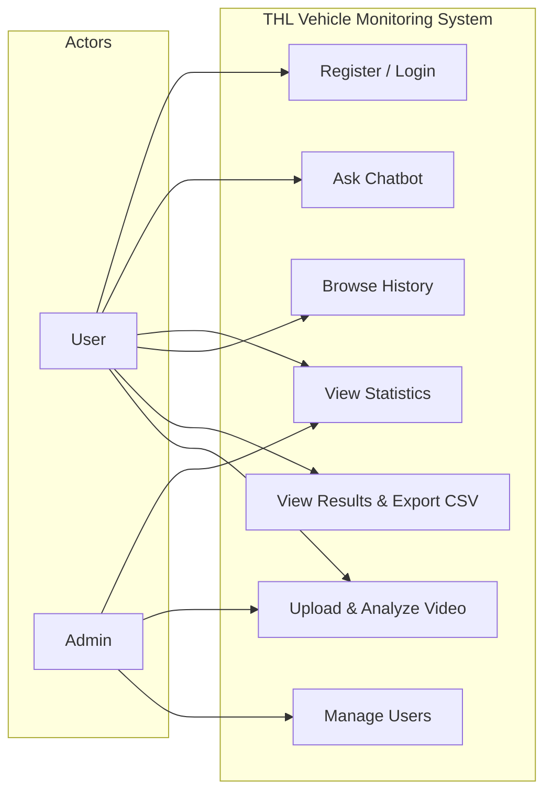

### 15.3. Sơ đồ triển khai

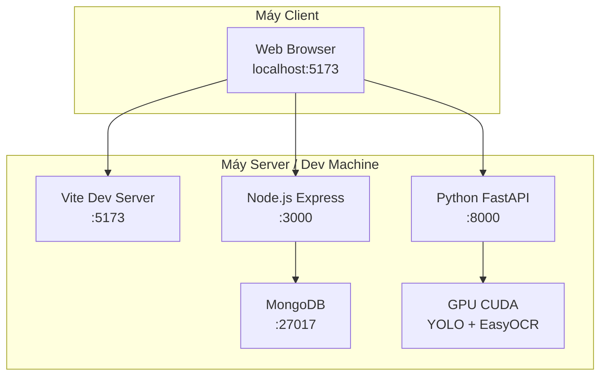

---

## CHƯƠNG 16. CÔNG NGHỆ SỬ DỤNG

### 16.1. Bảng tổng hợp

| Lĩnh vực | Công nghệ | Vai trò |
|----------|-----------|---------|
| **Ngôn ngữ** | Python 3.10+ | CV pipeline, API |
| | JavaScript (Node.js) 18+ | Backend API |
| | JavaScript (React) 19 | Frontend UI |
| **Deep Learning** | PyTorch | Runtime inference |
| | Ultralytics YOLOv8 | Object detection + tracking |
| | EasyOCR | Optical Character Recognition |
| **Computer Vision** | OpenCV | Video I/O, homography, Kalman, preprocessing |
| | NumPy | Ma trận, tính toán hình học |
| **Tracking** | BoT-SORT | Multi-object tracking + ReID |
| **Backend** | Express 5 | REST API |
| | Mongoose 9 | MongoDB ODM |
| | jsonwebtoken | JWT authentication |
| | bcrypt | Password hashing |
| | Nodemailer | Email verification |
| **Frontend** | React 19 | UI components |
| | Vite 8 | Build tool, HMR |
| | React Router 7 | Client-side routing |
| | Axios | HTTP client |
| | Chart.js | Data visualization |
| | Bootstrap 5 | CSS framework |
| **API Server** | FastAPI + Uvicorn | Python async REST API |
| **Database** | MongoDB 6+ | Document storage |
| **Media** | FFmpeg 8.x | Video transcoding H.264 |

### 16.2. Mô hình AI sử dụng

| Model | File weights | Input | Output |
|-------|-------------|-------|--------|
| Vehicle YOLO | `vehicle_model_v23/weights/best.pt` | Frame BGR | Bbox + class + track_id |
| Plate YOLO | `plate_only_train/weights/best.pt` | Frame/crop BGR | Bbox biển số |
| EasyOCR | Pretrained `en` | Grayscale plate crop | Text + confidence |
| BoT-SORT ReID | Auto (Ultralytics) | Detection features | Stable track_id |

---

## CHƯƠNG 17. ĐỀ XUẤT CẢI TIẾN TĂNG ĐỘ CHÍNH XÁC NHẬN DIỆN BIỂN SỐ

### 17.1. Cải tiến tầng phát hiện biển số (Detection)

| # | Đề xuất | Lý do | Mức ưu tiên |
|---|---------|-------|-------------|
| 1 | Huấn luyện lại Plate YOLO trên dataset đa dạng | Model hiện tại có thể miss biển ở điều kiện khó | Cao |
| 2 | Detect plate trên vehicle crop thay vì full frame | Giảm false positive, tăng resolution tương đối | Cao |
| 3 | Tăng imgsz lên 1920 hoặc multi-scale inference | Phát hiện biển nhỏ/xa tốt hơn | Trung bình |
| 4 | Data augmentation khi train | Tăng robustness | Trung bình |

### 17.2. Cải tiến tầng OCR (Recognition)

| # | Đề xuất | Lý do | Mức ưu tiên |
|---|---------|-------|-------------|
| 5 | Thay EasyOCR bằng model chuyên biển số VN (LPRNet, CRNN) | EasyOCR generic, không tối ưu cho biển VN | Cao |
| 6 | Fine-tune trên dataset biển số Việt Nam có label | Giảm lỗi nhầm ký tự (O/0, B/8) | Cao |
| 7 | Super-resolution trước OCR (Real-ESRGAN) | Biển nhỏ/xa sau upscale vẫn mờ | Trung bình |
| 8 | Giảm OCR_EVERY_N từ 5 xuống 2–3 | Tăng số lần đọc → majority vote chính xác hơn | Trung bình |

### 17.3. Cải tiến tiền xử lý và hậu xử lý

| # | Đề xuất | Lý do |
|---|---------|-------|
| 9 | Skip OCR nếu cache conf > 0.85 | Tránh OCR lại khi đã chắc chắn |
| 10 | Deblur trước OCR | Xe di chuyển nhanh → motion blur |
| 11 | Levenshtein distance voting trong PlateCache | Gom biển gần giống nhau |
| 12 | Tăng MIN_SCORE_ACCEPT lên 4.0–4.5 | Giảm false positive |

### 17.4. Cải tiến hạ tầng

| # | Đề xuất | Lý do |
|---|---------|-------|
| 13 | TensorRT / ONNX export cho YOLO | Giảm latency inference 2–5× |
| 14 | Camera calibration tự động thay homography cố định | Tốc độ chính xác hơn |
| 15 | Docker + GPU support | Triển khai reproducible |

### 17.5. Lộ trình đề xuất

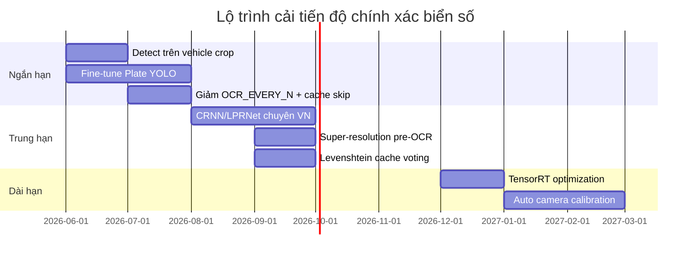

---

## KẾT LUẬN

Hệ thống **THL Vehicle Monitoring System** là một giải pháp giám sát giao thông thông minh hoàn chỉnh, kết hợp ba lĩnh vực: **Computer Vision** (YOLO + BoT-SORT + EasyOCR), **Web Application** (React + Node.js + MongoDB), và **Data Analytics** (thống kê + chatbot).

Pipeline xử lý video từ upload đến trả kết quả được triển khai theo mô hình job bất đồng bộ trên FastAPI. Module OCR biển số Việt Nam (PlateOCR LPR v2) là điểm nhấn kỹ thuật — sử dụng tiền xử lý đa tầng, multi-variant OCR, chuẩn hóa format, scoring, và majority vote qua PlateCache.

Hệ thống đáp ứng đầy đủ các mục tiêu đồ án: phát hiện phương tiện, tracking, tính vận tốc, nhận diện biển số, phát hiện vi phạm, trực quan hóa trên web, lưu trữ và tra cứu dữ liệu. Các hướng cải tiến ở Chương 17 sẽ nâng độ chính xác từ mức demo lên mức triển khai thực tế.

---

## PHỤ LỤC: HƯỚNG DẪN XUẤT WORD / PDF

### Xuất sang Word (.docx)

1. Mở [Pandoc](https://pandoc.org/) hoặc VS Code extension **Markdown PDF**.
2. Chạy lệnh:

```bash
pandoc docs/BAO_CAO_DO_AN.md -o docs/BAO_CAO_DO_AN.docx --toc
```

3. Mermaid diagrams: render tại [mermaid.live](https://mermaid.live), chèn ảnh PNG vào Word.

### Xuất sang PDF

```bash
pandoc docs/BAO_CAO_DO_AN.md -o docs/BAO_CAO_DO_AN.pdf --toc -V geometry:margin=2.5cm
```

Hoặc mở file `.docx` trong Microsoft Word → **File → Save As → PDF**.

---

*Phân tích từ mã nguồn dự án: `cv-core`, `backend`, `monitoring-plate-traffic`.*
